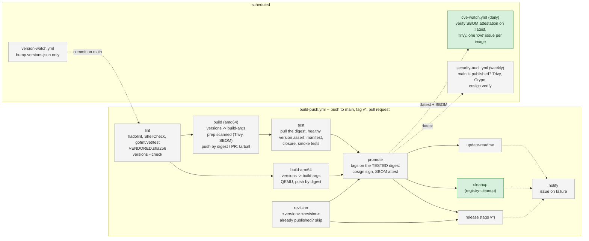

# hardened-ci

Shared CI building blocks for the `jbsky/*-hardened` container images
(bind9, nginx, php-fpm, varnish, suricata, squid/c-icap/clamav, uptime-kuma).

Each of those repositories used to carry its own copy of the same ~1 200 lines
of GitHub Actions and of six shared scripts, kept in sync by hand. This
repository is meant to hold them once:

| Kind | Shares | Used for |
|---|---|---|
| Reusable workflows (`on: workflow_call`) | whole jobs | `cve-watch`, `registry-cleanup`, `security-audit`, later `build-push` |
| Composite actions (`action.yml`) | steps + their scripts (via `github.action_path`) | revision counter, image manifest, dependency closure, README tags |

## The pipeline of an image repository

What every `*-hardened` repository runs, and where this repository plugs in.
Shared blocks are highlighted; the others are still local to each image
repository, with the plan step that will move them here.



| Block | Lives in | Since / plan |
|---|---|---|
| `versions` check + build-args (in lint, build, build-arm64) | **hardened-ci** action `versions/` | v0.1.0 -> v0.7.0, on all 7 |
| `cve-watch` | **hardened-ci** reusable workflow | v0.3.0, step 1 |
| `registry-cleanup` (cleanup job) | **hardened-ci** reusable workflow, runs the caller's `prune-*` | v0.3.0, step 1 |
| 6 vendored scripts (`build-revision`, `image-manifest`, `check-image-closure`, `prune-*`, `update-readme-tags`) | each repository + `VENDORED.sha256` | step 2: composite actions |
| `security-audit` | each repository | step 3 |
| `build-push` jobs (lint ... notify) | each repository | step 4, after the signing identity move (cve-watch already accepts both identities) |
| `version-watch` | each repository | stays local (logic is per upstream) |

On a pull request the image is built and tested from a tarball, never pushed:
`build-arm64`, `revision`, `promote` and what follows are skipped (bind9 adds a
`validate` job that builds both architectures on PRs). A `push` run re-tests the
exact digest it will tag -- a gate green on the PR is not proof for the push.

Building blocks land one at a time, each one first adopted by a single canary
repository. Every block is tested here **both ways**: it passes on a conforming
fixture and it must FAIL on a fixture with one injected defect
(`.github/workflows/test.yml`).

## Building blocks

### `versions` -- versions.json is the only place a version is written

A version written in two places drifts without anything failing (a local build
shipped 7.7.3 while CI published 8.0.0; an `.env.example` still said 8.0.2 when
`versions.json` said 8.0.7). This action makes `versions.json` authoritative:

```yaml
- name: Versions
  id: versions
  uses: jbsky/hardened-ci/versions@<sha> # vX.Y.Z
- uses: docker/build-push-action@v7
  with:
    build-args: ${{ steps.versions.outputs.build-args }}
```

1. **Check** (`scripts/versions-build-args.py --check`) fails on: a version ARG
   (`*_VERSION`, `*_VER`, `*_SHA256`, `*_COMMIT`, `*_TAG`) with a default value; an ARG with no
   key, or a key feeding no ARG; an ARG without a fail-fast guard; a
   `FROM alpine:<tag>@sha256` whose tag differs from `.alpine`, or with no
   digest; a `docker/build-push-action` step not fed by the generated
   build-args *in the same job* (the `prep` scan build included); a
   `NAME_VERSION=value` copy in `.env.example`, compose or the Makefile.
2. **Output** `build-args`: one `NAME=value` per line.

A repository that publishes several images from one `versions.json` (one
`Dockerfile` per subdirectory, no root `Dockerfile`) is checked as a whole: a
key must feed an ARG in at least one of them, and each ARG's guard is looked
up in the Dockerfile that consumes it.

Naming rule: key `foo` -> `FOO_VERSION`, `foo_sha256` -> `FOO_SHA256`,
`foo_commit` -> `FOO_COMMIT`, `foo_tag` -> `FOO_TAG`, `c-icap` -> `C_ICAP_VERSION`; `alpine` is the tag
of the `FROM alpine` lines (the base is pinned by digest, an ARG would drive
nothing). More generally, a key named after the base image of a `FROM` (`php`
for `FROM php:8.5.11-fpm-alpine@sha256:...`) feeds no ARG: it is the branch
that image follows, and every `FROM php:` must be digest-pinned and tagged
inside it (`8.5` accepts `8.5.11-fpm-alpine`, rejects `8.6.0` and `8.50.1`).

Local builds use the same script: `make build` runs
`docker compose build $(scripts/versions-build-args.py --docker)`; a bare
build fails at the Dockerfile guard in under a second.

`scripts/test_versions_build_args.py` holds one test per rule: each injects a
single defect into a conforming repository and requires the matching error.

### `cve-watch` -- daily re-audit of the published image (reusable workflow)

The final images are `FROM scratch`: no apk database, a scanner sees nothing.
`build-push` attests a CycloneDX SBOM of the `prep` stage on every published
digest; `cve-watch` verifies that attestation on `:latest` (signed by the
caller's `build-push.yml`, or by this repository's once `build-push` is shared),
runs Trivy on it, and keeps one `cve` issue per image: opened on a fixable
HIGH/CRITICAL CVE, commented when the list changes, closed when it is empty.
No SBOM = one "audit impossible" issue, never a silent "0 CVE". The issue
mentions the repository owner, so the e-mail does not depend on Watch settings.

```yaml
on:
  schedule: [{cron: '30 5 * * *'}]
  workflow_dispatch:
    inputs: {selftest: {type: boolean, default: false}}
permissions: {contents: read, issues: write, packages: read}
jobs:
  watch:
    uses: jbsky/hardened-ci/.github/workflows/cve-watch.yml@<sha> # vX.Y.Z
    with:
      images: '["php-fpm-hardened"]'
      selftest: ${{ inputs.selftest == true }}
```

`selftest: true` scans a known vulnerable image under a separate issue: the
end-to-end proof that an alert reaches the mailbox. Tested here both ways: the
issue logic is replayed on the script extracted from the shipped workflow
(`tests/cve-watch/issue.test.js`), and detection on two frozen SBOMs (one
vulnerable forever, one with a single fictitious package).

### `registry-cleanup` -- prune old immutable tags (reusable workflow)

Keeps the last `keep-count` (default 6) immutable tags per image plus
`:latest`, on GHCR and, when its secrets are passed, Docker Hub. Secrets are
passed explicitly (`secrets: inherit` is not guaranteed across repositories of
a personal account), and the calling job must grant `packages: write`.

```yaml
cleanup:
  needs: promote
  permissions: {contents: read, packages: write}
  uses: jbsky/hardened-ci/.github/workflows/registry-cleanup.yml@<sha> # vX.Y.Z
  with:
    images: '["php-fpm-hardened"]'
  secrets:
    DOCKERHUB_USERNAME: ${{ secrets.DOCKERHUB_USERNAME }}
    DOCKERHUB_TOKEN: ${{ secrets.DOCKERHUB_TOKEN }}
```

Not exercised by `test.yml` (it deletes tags): linted here, proved on a canary
by comparing tag lists before and after. Until step 2 it runs the caller's
vendored `scripts/prune-*.sh`.

### `template/` -- starting point of a new image repository

`./scripts/new-image.sh ../<app>-hardened` copies `template/` and adds the
shared scripts from `scripts/` (their reference copy; the template holds none
that could drift). The template ships with the `versions` check wired in: lint
job (`--check` + unit test), build job (`versions` action), Dockerfile without
any default and with its guard, `make build` through the generator.

CI instantiates it on every PR and proves it both ways: it passes the check,
the check fails once a version is hard-coded, a build without build-args fails
at the guard, and the built image carries the version from `versions.json`.

## Pinning policy

Callers pin a **full commit SHA**, with the release tag as a comment, never a
branch:

```yaml
uses: jbsky/hardened-ci/.github/workflows/cve-watch.yml@<40-char sha> # v1.2.0
```

- `@main` would let one push here break every image pipeline at once.
- Dependabot (`github-actions` ecosystem) in each caller proposes the bump,
  SHA and comment together. A change here is therefore one PR in this
  repository, then one bump PR per caller.
- Roll-out order: one canary repository, read its `push` run step by step
  (not only the pull-request run), then the others.

## Secrets and permissions

Reusable workflows declare the secrets they need; callers pass them
**explicitly** (`secrets: { DOCKERHUB_TOKEN: ${{ secrets.DOCKERHUB_TOKEN }} }`),
never `secrets: inherit`. Permissions are set on the calling job; a called
workflow can only lower them.

## Signing identity

Keyless cosign signatures carry the identity of the workflow that runs the
job. Once signing moves into a reusable workflow hosted here, that identity
becomes this repository's workflow, not the image repository's. Verifiers
(README commands, `cve-watch`, `security-audit`) must accept both identities
before that move. Until then, signing stays in each image repository.

## License

Apache-2.0, like the image repositories.
